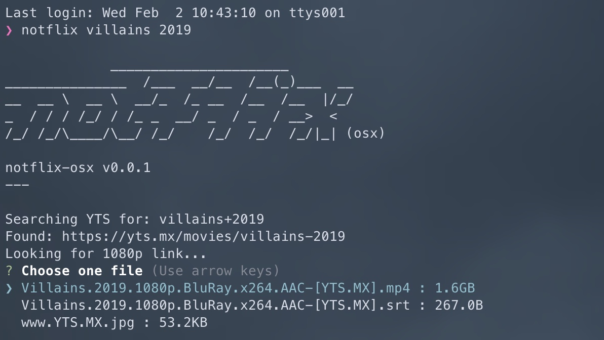

# Notflix-osx

Port of Bugswriter's [notflix](https://github.com/Bugswriter/notflix) to work with Mac. Updated script to use [YTS](https://yts.mx/) instead of 1337x. Grabs the first 1080p magnet link and passes to [peerflix](https://github.com/mafintosh/peerflix). Original bug [here](https://github.com/Bugswriter/notflix/issues/83).



## Usage

```
notflix [query]
```

## Requirements

- [vlc](https://github.com/videolan/vlc) - VLC is a libre and open source media player and multimedia engine, focused on playing everything, and running everywhere.
- [peerflix](https://github.com/mafintosh/peerflix) - Streaming torrent client for Node.js

## Installation

Run this command to download the latest `notflix` and install it in your $PATH.

```
git clone https://github.com/dylan-gluck/notflix && cd notflix && sudo cp -f ./notflix /usr/local/bin/notflix
```

## License

This project is licensed under [GPL-3.0](https://raw.githubusercontent.com/Illumina/licenses/master/gpl-3.0.txt).
